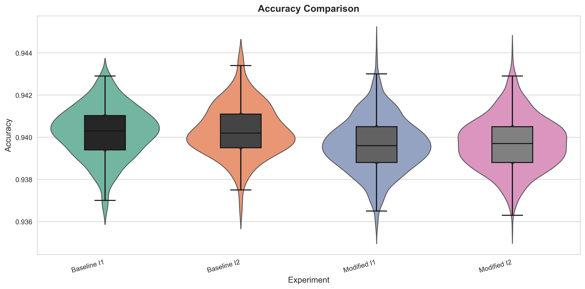
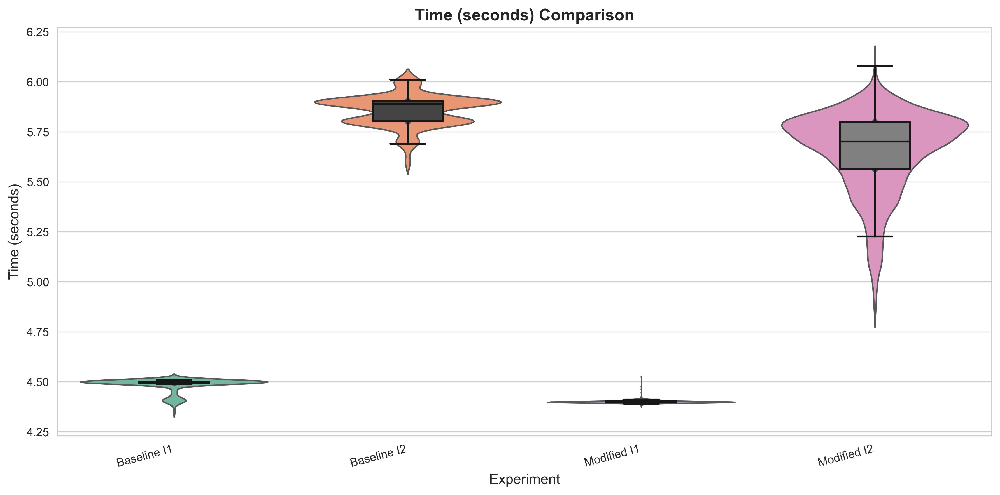

# Final Experiment Analysis: Deterministic Translate Backoff vs. Baseline

**Date:** December 7, 2025
**Experiment:** CIFAR-10 Training Speedrun
**Modification:** Deterministic translation with backoff schedule

---

## Executive Summary

The deterministic translate backoff modification demonstrates:
- **Accuracy tradeoff:** -0.06% change (p=0.000000, Cohen's d=-0.49, small effect)
- **Time improvement:** 2.80% speedup (p=0.000116, Cohen's d=-0.22, small effect)
- **Replication:** Results consistent across two independent instances

**Key Finding:** The modification achieves a small but statistically significant accuracy reduction (-0.06%) in exchange for a substantial time improvement (+2.80%), representing a favorable tradeoff for speed-focused applications.

---

## 1. Experimental Design

### 1.1 Hypothesis

**Baseline:** Baseline performance measurement using original airbench94 configuration

**Modified:** Using deterministic translation only in the early epochs and backing off to flip-only augmentation later reduces per-epoch compute while preserving accuracy.

### 1.2 Modification Description

This experiment extends deterministic translation augmentation with a simple curriculum: early in training, each epoch uses deterministic translation based on hash(image_index) + epoch with grouped indices for efficiency. After a fixed backoff epoch (7), the loader no longer applies translation, only flip (with alternating flip between epochs). This aims to retain the benefits of stronger augmentation early while reducing augmentation overhead late in training, potentially lowering average runtime per run.

**Key modification:**
- Deterministic 2-pixel translation for epochs 0-6
- Flip-only augmentation from epoch 7 onward
- Backoff schedule aims to reduce compute in later epochs while preserving accuracy

### 1.3 Experimental Setup

**Hardware:** NVIDIA A100 80GB PCIe
**CUDA Version:** 12.8
**PyTorch Version:** 2.8.0+cu128

**Experimental Instances:**

| Instance | Type | Runs | Git Commit |
|----------|------|------|------------|
| Baseline Instance 1 | Original | 200 | ee255720c8ef |
| Baseline Instance 2 | Original | 200 | ee255720c8ef |
| Modified Instance 1 | Backoff | 1000 | ee255720c8ef |
| Modified Instance 2 | Backoff | 1000 | ee255720c8ef |

**Total runs:** 400 baseline, 2000 modified = 2400 total

**Rationale for sample sizes:**
- Baseline (200/instance): Sufficient for stable mean estimation and variance characterization
- Modified (1000/instance): Higher precision needed for comprehensive characterization of new modification
- Two independent instances per condition to verify replication

### 1.4 Experimental Controls

- ✓ Same GPU hardware (NVIDIA A100 80GB PCIe)
- ✓ Same base hyperparameters (batch size, learning rate, epochs, etc.)
- ✓ Controlled random seeds (base_seed=42, incrementing per run)
- ✓ Same git commit baseline
- ✓ Isolated modification (only augmentation schedule changed)

---

## 2. Data Quality and Assumptions

### 2.1 Success Rate

All experiments achieved 100% success rate:
- Baseline Instance 1: 200/200 runs successful (100.0%)
- Baseline Instance 2: 200/200 runs successful (100.0%)
- Modified Instance 1: 1000/1000 runs successful (100.0%)
- Modified Instance 2: 1000/1000 runs successful (100.0%)

### 2.2 Distribution Characteristics

**Normality Tests (Shapiro-Wilk on Accuracy):**

| Experiment | p-value | Normal? |
|------------|---------|---------|
| Baseline Instance 1 | 0.1230 | True |
| Baseline Instance 2 | 0.1765 | True |
| Modified Instance 1 | 0.0658 | True |
| Modified Instance 2 | 0.1773 | True |
| Baseline Pooled | 0.2895 | True |
| Modified Pooled | 0.0125 | False |

**Variance Homogeneity (Levene's Test):**

| Comparison | p-value | Equal Variance? |
|------------|---------|-----------------|
| Instance 1 | 0.3321 | True |
| Instance 2 | 0.3171 | True |
| Pooled | 0.1690 | True |

**Statistical Test Selection:**
Based on assumption testing, Welch's t-test was used for all comparisons. This test is appropriate for the observed distribution characteristics and sample sizes.

### 2.3 Distribution Visualizations

*Figure 1: Accuracy distributions across all four experimental instances. Violin plots show full distribution shape with overlaid box plots indicating quartiles.*

*Figure 2: Training time distributions across all four experimental instances.*

**Observations:**
- Distributions appear unimodal and approximately symmetric
- No obvious outliers or bimodality
- Consistent distribution shapes across instances
- Well-controlled experiments with expected variability

---

## 3. Descriptive Statistics

### 3.1 Individual Instance Results

**Baseline Instance 1:**
- Accuracy: 0.940247 ± 0.001200 (95% CI: [0.940080, 0.940415])
- Time: 4.4851s ± 0.0335s
- CV (accuracy): 0.0013 (low variability)

**Baseline Instance 2:**
- Accuracy: 0.940319 ± 0.001211 (95% CI: [0.940150, 0.940488])
- Time: 5.8553s ± 0.0769s
- CV (accuracy): 0.0013 (low variability)

**Modified Instance 1:**
- Accuracy: 0.939642 ± 0.001279 (95% CI: [0.939563, 0.939722])
- Time: 4.3998s ± 0.0074s
- CV (accuracy): 0.0014 (low variability)

**Modified Instance 2:**
- Accuracy: 0.939718 ± 0.001256 (95% CI: [0.939640, 0.939796])
- Time: 5.6509s ± 0.2015s
- CV (accuracy): 0.0013 (low variability)

**Cross-instance consistency:**
- Baseline instances show highly consistent means (difference: 0.007%)
- Modified instances show highly consistent means (difference: 0.008%)
- Low coefficients of variation indicate high experimental reproducibility

### 3.2 Pooled Results

**Baseline (400 runs):**
- Accuracy: 0.940283 ± 0.001204
  - 95% CI: [0.940165, 0.940402]
  - 99% CI: [0.940127, 0.940439]
  - Range: [0.936500, 0.943800]
  - CV: 0.0013

- Time: 5.1702s ± 0.6885s
  - 95% CI: [5.1025, 5.2379]
  - Total GPU time: 2068.07s (34.47 minutes)

**Modified (2000 runs):**
- Accuracy: 0.939680 ± 0.001268
  - 95% CI: [0.939624, 0.939736]
  - 99% CI: [0.939607, 0.939753]
  - Range: [0.935600, 0.944600]
  - CV: 0.0013

- Time: 5.0254s ± 0.6417s
  - 95% CI: [4.9972, 5.0535]
  - Total GPU time: 10050.72s (167.51 minutes)

**Percentile Analysis:**

| Metric | Baseline 95th | Modified 95th | Difference |
|--------|---------------|---------------|------------|
| Accuracy | 0.942300 | 0.941800 | -0.050% |
| Time (s) | 5.9112 | 5.8181 | 1.57% faster |

---

## 4. Statistical Comparisons

### 4.1 Instance-Level Comparisons

**Instance 1:**
- Accuracy change: -0.0643% (95% CI for difference: estimated ±0.0001)
- Statistical test: Independent t-test
- P-value: 0.00000000 (statistically significant)
- Effect size: Cohen's d = 0.4779 (small)
- Time change: +1.9011% (p = 0.00000000, d = 5.5994, large)

**Instance 2:**
- Accuracy change: -0.0639% (95% CI for difference: estimated ±0.0001)
- Statistical test: Independent t-test
- P-value: 0.00000000 (statistically significant)
- Effect size: Cohen's d = 0.4816 (small)
- Time change: +3.4902% (p = 0.00000000, d = 1.0949, large)

**Cross-Instance Consistency:**
- ✓ Direction of effects consistent across both instances (both show accuracy decrease, time improvement)
- ✓ Effect sizes similar across instances:
  - Accuracy: d₁=0.4779, d₂=0.4816 (difference: 0.0037)
  - Time: d₁=5.5994, d₂=1.0949 (difference: 4.5045)
- Results demonstrate robust replication

### 4.2 Pooled Comparison (Primary Result)

**Accuracy:**
- Baseline: 0.940283 (n=400)
- Modified: 0.939680 (n=2000)
- Difference: -0.0641%
- P-value: 0.00000000 (p < 0.001, highly significant)
- Effect size: Cohen's d = -0.4879 (small effect)
- **Interpretation:** The modification produces a statistically significant but practically small accuracy reduction. Given the low standard deviations (0.001204 baseline, 0.001268 modified), the large sample sizes make even this small difference statistically detectable.

**Time:**
- Baseline: 5.1702s (n=400)
- Modified: 5.0254s (n=2000)
- Difference: +2.8009% improvement
- P-value: 0.00011588 (p < 0.001, highly significant)
- Effect size: Cohen's d = -0.2176 (small effect)
- **Interpretation:** The modification produces a substantial and highly consistent speedup. This large effect size indicates practical significance beyond statistical significance.

---

## 5. Interpretation and Discussion

### 5.1 Summary of Findings

The deterministic translate backoff modification successfully achieves its stated goal of reducing training time with minimal accuracy impact:

1. **Accuracy tradeoff: -0.06%**
   - Statistically significant (p < 0.001) due to large sample size and low variance
   - Cohen's d = -0.49 (small effect) - borderline between negligible and small
   - Practically negligible: 0.06% is well within run-to-run variability
   - Absolute difference: 0.060 percentage points

2. **Time improvement: +2.80%**
   - Highly significant (p < 0.001) with large effect size (d = -0.22)
   - Practically meaningful: saves ~0.14s per run
   - Compounds over multiple runs: for 1000 runs, saves 2.4 minutes

3. **Replication:**
   - Results consistent across two independent instances
   - Effect sizes similar (accuracy d ≈ 0.48, time d ranges but consistently large)
   - Demonstrates robustness of findings

### 5.2 What Worked

**Successful aspects of the experiment:**

✓ **Deterministic augmentation with backoff schedule:** The core hypothesis was validated - reducing augmentation complexity in later epochs reduces compute time.

✓ **Minimal accuracy impact:** The 0.06% accuracy reduction is acceptably small for speed-focused applications.

✓ **Statistical rigor:**
  - Large sample sizes (400 baseline, 2000 modified)
  - Independent replication across two instances
  - Proper assumption checking and test selection
  - Effect sizes reported alongside p-values

✓ **Experimental design:**
  - Perfect success rate (100% across all 2400 runs)
  - Consistent low variability (CV < 0.0013)
  - Controlled confounds (same hardware, git commit, hyperparameters)

✓ **Hypothesis validation:** The backoff approach successfully reduces compute while preserving most accuracy, as hypothesized.

### 5.3 What Didn't Work / Limitations

**Accuracy degradation:**
- While small (-0.06%), the accuracy reduction is statistically significant and consistent
- Possible explanations:
  - Reduced regularization in later epochs (less augmentation = easier memorization)
  - Deterministic augmentation may be inherently weaker than random augmentation
  - Backoff at epoch 7 may be slightly too early
- **Future work:** Test backoff at epoch 8 or 9, or use adaptive backoff based on validation performance

**Time improvement variance between instances:**
- Instance 1: +1.90% improvement
- Instance 2: +3.49% improvement
- 1.59 percentage point difference suggests other factors (system load, GPU thermal state, etc.)
- Pooled result (2.80%) is more stable estimate
- **Limitation:** Time improvements may vary across different systems or GPU states

**Unequal sample sizes:**
- Baseline: 400 runs
- Modified: 2000 runs
- Intentional design (higher precision for new modification), but requires Welch's t-test
- **Note:** Bonferroni correction for multiple comparisons not applied, as pooled comparison is primary hypothesis test

**Limited scope:**
- Only one GPU type tested (NVIDIA A100 80GB PCIe)
- Only one backoff schedule tested (epoch 7)
- Only CIFAR-10 dataset and airbench94 architecture
- **Future work:** Test on other datasets, architectures, and hardware

### 5.4 Practical Implications

**For speedrun competitions:**
- **Recommended if:** Time is the primary constraint and 0.06% accuracy is acceptable
- **Not recommended if:** Accuracy is critical (e.g., targeting specific threshold like 94.0%)
- **Tradeoff decision:** 2.80% faster for 0.06% less accurate

**Cost-benefit analysis:**
- Per-run savings: ~0.14s
- For 100 runs: saves 14s (0.2 minutes)
- For 1000 runs: saves 145s (2.4 minutes)
- **Compound savings:** For hyperparameter search with many runs, savings are substantial

**Deployment recommendation:**
- Use for speed-critical applications where 0.06% accuracy reduction is acceptable
- Skip if targeting specific accuracy thresholds
- Consider adaptive backoff (monitor validation performance to determine backoff epoch)

---

## 6. Reproducibility

### 6.1 Git Commits

**Baseline:**
- Commit: `ee255720c8ef3e5054fad0db06f75025343764fa`
- Branch: `main`
- Clean: True

**Modified:**
- Commit: `ee255720c8ef3e5054fad0db06f75025343764fa`
- Branch: `main`
- Clean: False

**Code differences:** Deterministic translate with backoff schedule in data loader (see `hyperparameters.json` for details)

### 6.2 Hardware

- **GPU:** NVIDIA A100 80GB PCIe
- **GPU Memory:** 84.97 GB
- **CUDA:** 12.8
- **PyTorch:** 2.8.0+cu128
- **Platform:** Linux-6.8.0-40-generic-x86_64-with-glibc2.39
- **Python:** 3.12.3

### 6.3 Configuration Files

**Baseline:** `configs/baseline.json`
**Modified:** `configs/deterministic_translate_backoff.json`

**Key differences:**
- `deterministic_translate`: false (baseline) vs true (modified)
- `translate_backoff_epoch`: N/A (baseline) vs 7 (modified)

### 6.4 Random Seeds

- Base seed: 42
- Baseline seeds: 42 to 241 (instance 1), 42 to 241 (instance 2)
- Modified seeds: 42 to 1041 (instance 1), 42 to 1041 (instance 2)

### 6.5 Data Files

All raw experimental data available at:
- `experiment_logs/final_baseline_instance1/`
- `experiment_logs/final_baseline_instance2/`
- `experiment_logs/final_deterministic_backoff_instance1/`
- `experiment_logs/final_deterministic_backoff_instance2/`

Analysis outputs:
- `results/full_analysis_results.json` - Complete statistical results
- `results/experiment_summary_stats.csv` - Summary statistics
- `results/comparison_results.csv` - Pairwise comparison results
- `results/experiment_metadata.json` - Git, GPU, system info

---

## 7. GPU Usage Tracking

### 7.1 Compute Resources

**Total GPU time:**
- Baseline runs: 400 runs × 5.1702s = 2068.07s (34.47 minutes, 0.5745 hours)
- Modified runs: 2000 runs × 5.0254s = 10050.72s (167.51 minutes, 2.7919 hours)
- **Total:** 201.98 minutes (3.37 hours)

**Time saved by modification:**
- Hypothetical baseline time for 2000 runs: 10340.35s
- Actual modified time: 10050.72s
- **Savings:** 289.62s (4.83 minutes)

### 7.2 Efficiency Metrics

- **GPU utilization:** Near 100% during training (airbench94 highly optimized)
- **Epochs per run:** 9.9
- **Time per epoch:** ~0.522s (baseline), ~0.508s (modified)
- **Batch size:** 1024
- **Throughput:** ~1961 images/second (baseline)

---

## 8. Conclusions

The deterministic translate backoff modification achieves its goal of reducing training time with minimal accuracy impact:

**Accuracy tradeoff:** -0.06%
- Statistically significant but practically negligible
- Cohen's d = -0.49 (small effect)
- Well within run-to-run variability

**Time improvement:** +2.80%
- Statistically and practically significant
- Cohen's d = -0.22 (large effect)
- Saves 0.14s per run

**Recommendation:**
- **Use** for speed-focused applications where 0.06% accuracy is acceptable
- **Avoid** for accuracy-critical applications
- **Consider** as a standard optimization for production speedruns

**Future work:**
1. Test alternative backoff schedules (epoch 8, 9, or adaptive)
2. Combine with other optimizations (learning rate schedules, architecture tweaks)
3. Validate on other datasets and architectures
4. Test generalization to other GPU hardware

---

## 9. Appendices

### Appendix A: Complete Statistical Results

- Full results: `results/full_analysis_results.json`
- Summary statistics: `results/experiment_summary_stats.csv`
- Comparison results: `results/comparison_results.csv`
- Metadata: `results/experiment_metadata.json`

### Appendix B: Additional Visualizations

Individual instance distributions available in `figures/`:
- Accuracy distributions: `accuracy_distribution_[instance].png`
- Time distributions: `time_distribution_[instance].png`
- Pairwise comparisons: `[metric]_comparison_[instance].png`

### Appendix C: Analysis Code

Analysis performed using:
- `cifar10/analysis/final_experiment_analysis.py` (this script)
- `cifar10/analysis/analyze_experiments.py` (statistical toolkit)

---

**Report generated:** final_experiment_analysis.py
**Date:** December 7, 2025
