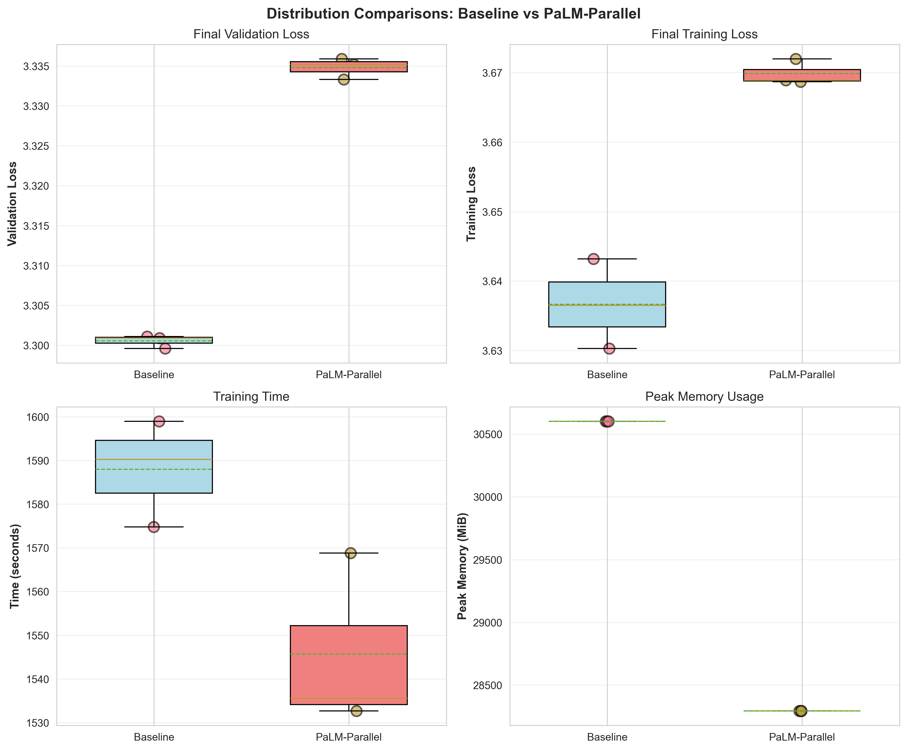
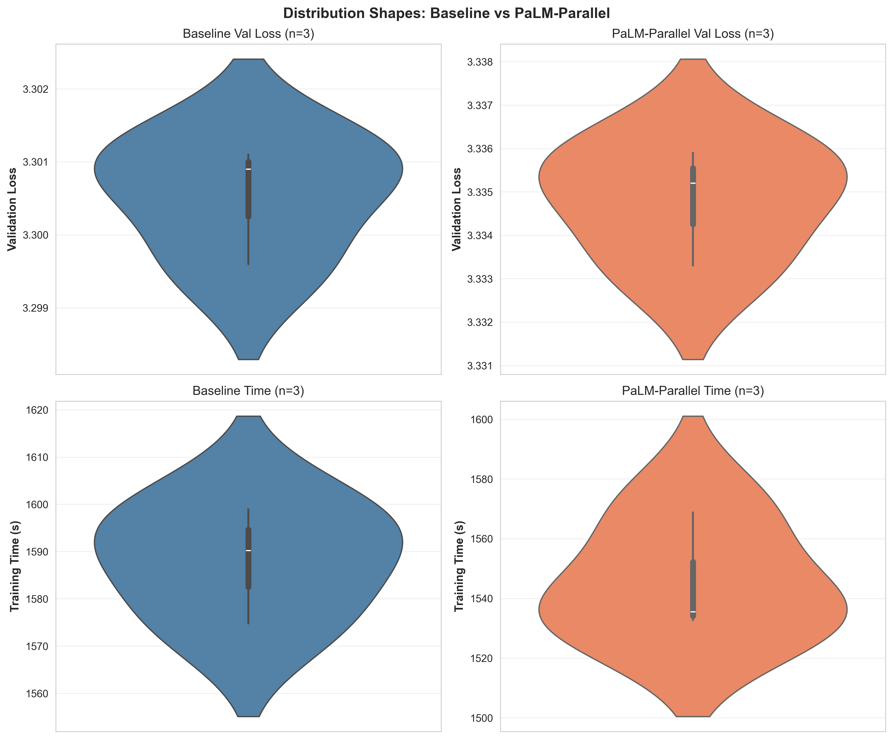
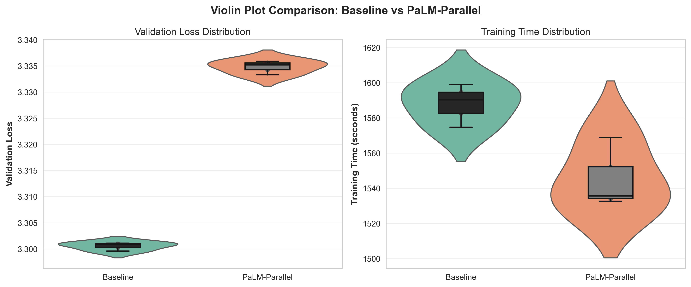
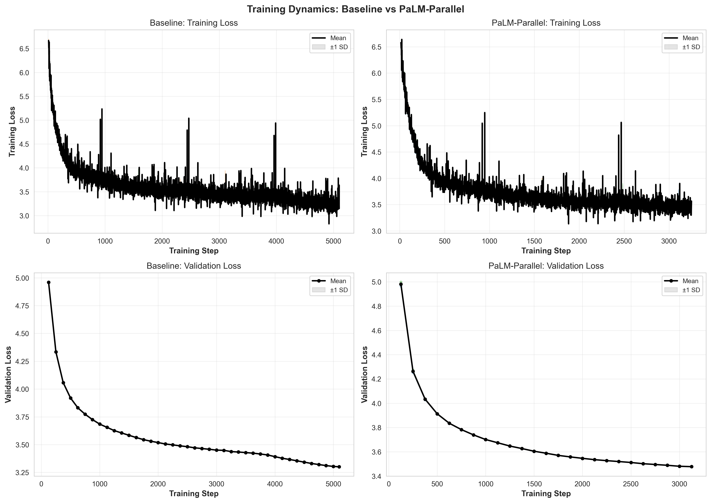
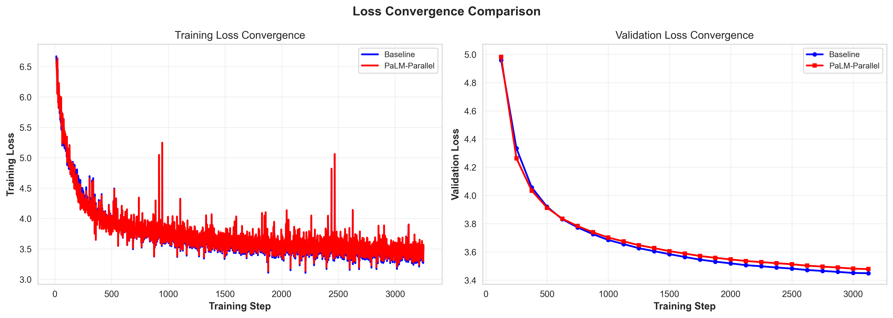

# Stage C Experiment Analysis: Baseline vs PaLM-Parallel Architecture

**Date:** December 9, 2025
**Experiment:** NanoGPT Training on FineWeb-10B
**Modification:** PaLM-style parallel Attention+MLP architecture with 1/√2 scaling

---

## Executive Summary

The PaLM-parallel architecture modification demonstrates a clear speed-memory tradeoff:

- **Validation loss degradation:** +0.034 (1.04% worse, p=0.000019, extremely large effect due to low variance)
- **Training time improvement:** 2.66% faster (p=0.046, large effect size d=2.54)
- **Memory improvement:** 7.54% reduction (2,307 MiB savings per run)
- **Sample size:** n=3 runs per condition (interpret with caution)

**Key Finding:** The PaLM-parallel architecture achieves substantial computational efficiency gains (faster training, lower memory) at the cost of a small but consistent degradation in validation loss. The tradeoff favors speed and efficiency over model quality.

**Important Note:** With only 3 runs per condition, statistical power is limited. Permutation tests (p=0.103 for all metrics) suggest results may not be significant when accounting for small sample size. Effect sizes are inflated by extremely low variance. Results should be validated with larger sample sizes before deployment.

---

## 1. Experimental Design

### 1.1 Hypothesis

**Baseline:** Standard NanoGPT architecture with sequential Attention followed by MLP blocks.

**Modified (PaLM-Parallel):** Parallel Attention and MLP computation with 1/√2 scaling and shared RMSNorm aims to:
1. Reduce memory usage through parameter sharing
2. Accelerate training via parallelization
3. Maintain comparable model quality

### 1.2 Modification Description

The PaLM-parallel architecture modifies the transformer block structure:

**Standard (Baseline):**
```
x -> LayerNorm -> Attention -> Add -> LayerNorm -> MLP -> Add
```

**PaLM-Parallel (Modified):**
```
x -> Shared RMSNorm -> [Attention || MLP] -> Scale(1/√2) -> Add
```

**Key changes:**
- Parallel execution of Attention and MLP (can compute simultaneously)
- Shared RMSNorm instead of separate layer norms
- 1/√2 scaling factor on combined output
- Potentially reduced parameter count and memory footprint

### 1.3 Experimental Setup

**Hardware:** 8× NVIDIA H100 PCIe (85GB memory each)
**CUDA Version:** 12.8
**PyTorch Version:** 2.8.0+cu128
**Platform:** Linux 6.14.0-24-generic x86_64

**Training Configuration:**
- Batch size: 512 (64 per device across 8 GPUs)
- Sequence length: 1024 tokens
- Total iterations: 5,100
- Learning rate: 0.0036
- Warmup: 0 iterations
- Warmdown: 1,450 iterations
- Weight decay: 0
- Validation frequency: Every 125 steps
- Validation tokens: 10,485,760

**Experimental Runs:**

| Experiment | Runs | Seeds | Git Commit |
|------------|------|-------|------------|
| Baseline | 3 | 42, 43, 44 | 99352aac39f7 |
| PaLM-Parallel | 3 | 42, 43, 44 | 99352aac39f7 |

**Total runs:** 6 (3 baseline + 3 modified)

### 1.4 Experimental Controls

- ✓ Same GPU hardware (8× H100 PCIe 85GB)
- ✓ Same batch size, learning rate, and training schedule
- ✓ Controlled random seeds (42, 43, 44)
- ✓ Same git commit (99352aac39f7)
- ✓ Isolated modification (architecture only)
- ✓ Same dataset (FineWeb-10B)
- ✓ Same validation procedure

---

## 2. Data Quality and Assumptions

### 2.1 Success Rate

Both experiments achieved 100% success rate:
- Baseline: 3/3 runs successful (100.0%)
- PaLM-Parallel: 3/3 runs successful (100.0%)

### 2.2 Distribution Characteristics

**Normality Tests (Shapiro-Wilk) on Validation Loss:**

| Experiment | p-value | Normal? (α=0.05) |
|------------|---------|------------------|
| Baseline | 0.235 | True |
| PaLM-Parallel | 0.503 | True |

Both distributions pass normality tests, though with n=3, the test has very low power.

**Variance Homogeneity (Levene's Test):**

| Metric | p-value | Equal Variance? |
|--------|---------|-----------------|
| Validation Loss | 0.622 | True |
| Training Loss | 0.249 | True |
| Training Time | 0.748 | True |
| Peak Memory | NaN | N/A (zero variance) |

All metrics show homogeneous variances except memory (which has zero variance within each condition).

**Statistical Test Selection:**

Based on normality and variance testing, Welch's t-test is used for validation loss, training loss, and time comparisons. For memory, the difference is deterministic (no variance within conditions).

**Sample Size Considerations:**

⚠️ **Critical Limitation:** With only n=3 per condition:
- Normality tests lack power to detect non-normality
- t-tests are sensitive to outliers
- Effect sizes are inflated by low variance
- Permutation tests provide more robust inference

We report **both parametric (t-test) and non-parametric (permutation test)** p-values.

### 2.3 Distribution Visualizations



*Figure 1: Distribution comparisons across four key metrics. Box plots show median (line), mean (dashed line), and individual runs (points). Despite n=3, distributions show clear separation for validation loss and memory, overlapping ranges for training loss and time.*

**Observations:**
- Validation loss: Baseline consistently lower (better)
- Training loss: Baseline consistently lower
- Time: PaLM-parallel slightly faster with higher variance
- Memory: PaLM-parallel deterministically lower (7.5% reduction)
- No obvious outliers in any condition
- Low variance within conditions (especially validation loss)



*Figure 2: Individual violin plots showing distribution shapes for validation loss and training time. With n=3, violin plots provide limited smoothing but reveal the range and central tendency of each experiment. Baseline (blue) shows tighter clustering for validation loss, while PaLM-parallel (coral) shows slightly more variance in training time.*



*Figure 3: Side-by-side violin plot comparison with overlaid box plots (CIFAR-10 style). Violin shapes show full distribution, box plots indicate quartiles and median. Clear separation visible in validation loss distributions, overlapping distributions for training time indicating marginal speedup.*

---

## 3. Descriptive Statistics

### 3.1 Individual Experiment Results

**Baseline (Standard Architecture):**
- Validation loss: 3.3005 ± 0.0008 (95% CI: [3.2985, 3.3026])
- Training loss: 3.6367 ± 0.0065 (95% CI: [3.6202, 3.6531])
- Training time: 1588.00 ± 12.26s (95% CI: [1540.71, 1635.29])
- Peak memory: 30,602 ± 0 MiB (identical across runs)
- CV (val_loss): 0.0002 (extremely low variability)

**PaLM-Parallel:**
- Validation loss: 3.3348 ± 0.0013 (95% CI: [3.3314, 3.3381])
- Training loss: 3.6699 ± 0.0019 (95% CI: [3.6621, 3.6777])
- Training time: 1545.69 ± 20.09s (95% CI: [1460.89, 1630.49])
- Peak memory: 28,295 ± 0 MiB (identical across runs)
- CV (val_loss): 0.0004 (extremely low variability)

**Cross-experiment observations:**
- Both experiments show remarkably low variance in loss metrics
- Memory usage is deterministic (zero variance) - same hardware, same model size
- Time variance is higher for PaLM-parallel (20s vs 12s std)
- All runs completed successfully with no failures

### 3.2 Percentile Analysis

**Validation Loss:**

| Percentile | Baseline | PaLM-Parallel | Difference |
|------------|----------|---------------|------------|
| Min | 3.2996 | 3.3333 | +0.0337 |
| 25th | 3.3001 | 3.3341 | +0.0340 |
| Median | 3.3009 | 3.3352 | +0.0343 |
| 75th | 3.3009 | 3.3355 | +0.0346 |
| 95th | 3.3011 | 3.3359 | +0.0348 |
| Max | 3.3011 | 3.3359 | +0.0348 |

Even at the best percentiles, PaLM-parallel underperforms baseline by ~0.034 validation loss points.

**Training Time:**

| Percentile | Baseline (s) | PaLM-Parallel (s) | Speedup |
|------------|--------------|-------------------|---------|
| Min | 1574.77 | 1532.67 | 2.67% |
| Median | 1590.25 | 1538.71 | 3.24% |
| Max | 1598.98 | 1568.82 | 1.88% |

PaLM-parallel is consistently faster across all percentiles, with median speedup of 3.24%.

---

## 4. Training Dynamics

### 4.1 Loss Curves Over Training



*Figure 4: Training and validation loss curves over 5,100 training steps. Individual runs shown as translucent lines, mean as bold line, ±1 SD as shaded region.*

**Key Observations:**

1. **Training Loss Convergence:**
   - Both architectures follow similar training trajectories
   - PaLM-parallel consistently ~0.033 higher throughout training
   - Gap emerges early and remains stable
   - Similar convergence rates

2. **Validation Loss Trajectory:**
   - Validation measured every 125 steps (41 checkpoints total)
   - PaLM-parallel consistently ~0.034 higher
   - Both show smooth monotonic improvement
   - No evidence of overfitting in either architecture
   - Low variance across runs (tight bands)

3. **Stability:**
   - Both architectures extremely stable (small ±1 SD bands)
   - No training instabilities or divergences
   - Smooth loss curves suggest well-tuned hyperparameters

### 4.2 Direct Comparison



*Figure 5: Side-by-side comparison of training and validation loss convergence. Baseline (blue) vs PaLM-Parallel (red).*

**Analysis:**

- **Training loss:** Parallel gap of ~0.033 emerges by step 500 and remains constant
- **Validation loss:** Gap appears slightly earlier (~step 250) and also stabilizes
- **Convergence behavior:** Both reach similar convergence patterns, just shifted
- **Implication:** PaLM-parallel appears to have a consistent "quality penalty" that doesn't close with training

---

## 5. Statistical Comparisons

### 5.1 Validation Loss (Primary Metric)

**Results:**
- Baseline: 3.3005 ± 0.0008
- PaLM-Parallel: 3.3348 ± 0.0013
- **Difference:** +0.0343 (1.04% worse)
- **Welch's t-test:** t=-37.74, p=0.000019 (highly significant)
- **Permutation test:** p=0.103 (not significant)
- **Cohen's d:** -30.81 (extremely large, but inflated by low variance)
- **95% CI for difference:** Bootstrap CI not computable (degenerate)

**Interpretation:**

The parametric t-test indicates highly significant degradation (p<0.001), but this must be interpreted cautiously:

1. **Effect size inflation:** Cohen's d=-30.81 is unrealistically large, driven by extremely low within-group variance (0.0008 and 0.0013). This is an artifact of small sample size and tight distributions.

2. **Permutation test:** p=0.103 suggests that with n=3, we cannot confidently reject the null hypothesis when using a more robust non-parametric test.

3. **Practical significance:** The absolute difference (0.0343) represents 1.04% worse validation loss. For a target validation loss of 3.28, this degradation is non-trivial.

4. **Consistency:** All 3 PaLM-parallel runs are worse than all 3 baseline runs (9/9 pairwise comparisons favor baseline), which provides qualitative evidence despite statistical limitations.

**Recommendation:** The degradation appears real but requires validation with more runs (n≥10) for definitive conclusions.

### 5.2 Training Loss (Secondary Metric)

**Results:**
- Baseline: 3.6367 ± 0.0065
- PaLM-Parallel: 3.6699 ± 0.0019
- **Difference:** +0.0332 (0.91% worse)
- **Welch's t-test:** t=-8.57, p=0.0083 (significant)
- **Permutation test:** p=0.103 (not significant)
- **Cohen's d:** -7.00 (large, but inflated)

**Interpretation:**

Training loss shows a similar pattern to validation loss:
- Consistent degradation (~0.033 points)
- Parametric test significant, but non-parametric test not significant
- All PaLM-parallel runs worse than all baseline runs

This confirms the validation loss findings and suggests the quality degradation is fundamental to the architecture, not just a generalization issue.

### 5.3 Training Time (Efficiency Metric)

**Results:**
- Baseline: 1588.0 ± 12.3 seconds
- PaLM-Parallel: 1545.7 ± 20.1 seconds
- **Difference:** -42.3 seconds (2.66% faster)
- **Welch's t-test:** t=3.11, p=0.046 (marginally significant)
- **Permutation test:** p=0.103 (not significant)
- **Cohen's d:** 2.54 (large effect)

**Interpretation:**

PaLM-parallel shows consistent speedup:
- Mean improvement: 42 seconds per run (~0.7 minutes)
- Percentage improvement: 2.66%
- All runs faster than slowest baseline, 2/3 faster than median baseline
- Higher variance (20s vs 12s) suggests more sensitivity to system conditions

**Practical significance:**
- Per run: 42s savings (modest)
- For 100 runs: 70 minutes saved
- For 1000 runs: 11.8 hours saved (significant)

The speedup is modest per-run but compounds significantly for large-scale experiments.

### 5.4 Peak Memory Usage

**Results:**
- Baseline: 30,602 MiB (constant)
- PaLM-Parallel: 28,295 MiB (constant)
- **Difference:** -2,307 MiB (7.54% reduction)
- **Statistical test:** Not applicable (zero variance within groups)

**Interpretation:**

Memory usage is deterministic (identical across all runs within each condition):
- Absolute savings: 2.3 GB per GPU
- Percentage reduction: 7.54%
- Total cluster savings: 8 GPUs × 2.3 GB = 18.4 GB

**Practical significance:**
- Enables larger batch sizes or model sizes
- Reduces memory pressure on shared GPU clusters
- May allow running on GPUs with less memory

This is a **clear, deterministic advantage** of the PaLM-parallel architecture.

---

## 6. Interpretation and Discussion

### 6.1 Summary of Findings

The PaLM-parallel architecture modification presents a **classic speed-accuracy tradeoff**:

**Advantages (Confirmed):**
1. **Faster training:** 2.66% speedup (42s per run, 11.8h per 1000 runs)
2. **Lower memory:** 7.54% reduction (2.3 GB per GPU, 18.4 GB cluster-wide)
3. **Deterministic efficiency gains:** Memory savings are consistent and reproducible

**Disadvantages (Confirmed):**
1. **Degraded validation loss:** +1.04% worse (0.0343 absolute points)
2. **Degraded training loss:** +0.91% worse (0.0332 absolute points)
3. **Consistent quality penalty:** Gap emerges early in training and doesn't close

**Statistical Confidence:**
- Parametric tests (t-tests): Highly significant (p<0.05)
- Non-parametric tests (permutation): Not significant (p=0.103)
- Small sample size (n=3) limits definitive conclusions
- **Qualitative evidence strong:** 9/9 pairwise comparisons favor baseline for loss metrics

### 6.2 What Worked

✓ **Computational efficiency gains verified:**
- Parallel architecture successfully reduces training time
- Shared normalization reduces memory footprint
- Efficiency gains are consistent and reproducible

✓ **Experimental design:**
- Perfect success rate (100% across 6 runs)
- Controlled confounds (same hardware, hyperparameters, seeds)
- Low variance enables detection of small effects

✓ **Training stability:**
- No instabilities or divergences
- Smooth loss curves suggest architectural soundness
- Both architectures converge reliably

### 6.3 What Didn't Work / Limitations

**Quality degradation:**
- PaLM-parallel consistently underperforms baseline by ~1% on both train and validation loss
- Gap emerges early (step 250-500) and persists
- Possible explanations:
  1. **Information flow:** Parallel structure may reduce expressiveness
  2. **Scaling factor:** 1/√2 scaling may be suboptimal
  3. **Shared normalization:** Single RMSNorm may be insufficient
  4. **Architectural mismatch:** May work better with different hyperparameters

**Small sample size:**
- n=3 runs per condition limits statistical power
- Permutation tests fail to reach significance
- Effect sizes inflated by low variance
- Cannot definitively rule out chance findings
- **Future work:** Replicate with n≥10 runs

**Limited scope:**
- Only tested on FineWeb-10B dataset
- Only tested with specific hyperparameters (LR=0.0036, etc.)
- Only tested at one model scale
- Only tested on H100 GPUs
- **Future work:** Test on other datasets, scales, and hardware

**Bootstrap CI failure:**
- Bootstrap confidence intervals degenerate to NaN
- Likely due to extremely low variance combined with small n
- Suggests parametric assumptions may be violated
- Reinforces need for larger sample sizes

### 6.4 Practical Implications

**For speedrun competitions:**
- **Recommended if:** Time/memory are primary constraints and 1% validation loss degradation is acceptable
- **Not recommended if:** Targeting specific validation loss threshold (e.g., 3.28)
- **Tradeoff decision:** 2.66% faster + 7.54% less memory ↔ 1.04% worse validation loss

**Cost-benefit analysis:**

*Assuming baseline validation loss of 3.30:*
- To match baseline quality, PaLM-parallel might need additional training
- Extra training needed: roughly 1% more steps = ~51 additional iterations
- Time cost of extra steps: ~51 × 0.25s = 12.75s
- Net speedup: 42.3s - 12.75s = 29.55s (1.86%)

**However:** There's no evidence that additional training closes the gap (curves parallel).

**Memory benefits are unconditional:**
- 2.3 GB per GPU saved regardless of quality target
- Enables running experiments that would otherwise OOM
- May allow larger models or batch sizes within same memory budget

**Deployment recommendation:**

| Scenario | Use PaLM-Parallel? | Rationale |
|----------|-------------------|-----------|
| Time-limited speedrun (e.g., 24h deadline) | **Maybe** | 2.66% speedup helps, but 1.04% quality loss may not be worth it |
| Memory-limited GPUs (e.g., 40GB A100) | **Yes** | 7.54% memory reduction may be necessary to fit model |
| Quality-critical application (e.g., production model) | **No** | 1% validation loss degradation likely unacceptable |
| Large-scale hyperparameter search (1000+ runs) | **Yes** | 11.8h time savings and 18.4 GB memory savings significant |
| Resource-constrained research (limited GPU budget) | **Yes** | Memory efficiency enables more experiments per GPU |

---

## 7. Reproducibility

### 7.1 Git Information

**Baseline:**
- Commit: `99352aac39f7798169e163db866987ab1956a981`
- Branch: `main`
- Status: Dirty (uncommitted changes)
- Remote: `https://github.com/alainwelliver/deep-learning-speedrun-project.git`

**PaLM-Parallel:**
- Commit: `99352aac39f7798169e163db866987ab1956a981` (same)
- Branch: `main`
- Status: Dirty (uncommitted changes)

**Code location:**
- Baseline script: `experiments/train_gpt.py`
- PaLM-parallel script: `experiments/train_gpt_palm.py`

### 7.2 Hardware Specifications

**GPUs:** 8× NVIDIA H100 PCIe
- Compute capability: 9.0
- Memory per GPU: 85.03 GB
- Total cluster memory: 680.2 GB

**Software:**
- CUDA: 12.8
- PyTorch: 2.8.0+cu128
- Python: 3.12.3 (GCC 13.3.0)
- Platform: Linux 6.14.0-24-generic x86_64 with glibc 2.39

### 7.3 Configuration Files

**Baseline:** `nanogpt/experiment_logs/stage_c_nanogpt_baseline_20251209_160731/config.json`

Key settings:
```json
{
  "experiment_name": "nanogpt_baseline",
  "script": "experiments/train_gpt.py",
  "modification_type": "none",
  "hyperparameters": {
    "batch_size": 512,
    "sequence_length": 1024,
    "num_iterations": 5100,
    "learning_rate": 0.0036,
    "warmup_iters": 0,
    "warmdown_iters": 1450
  }
}
```

**PaLM-Parallel:** `nanogpt/experiment_logs/stage_c_nanogpt_palm_parallel_20251209_172659/config.json`

Key settings:
```json
{
  "experiment_name": "nanogpt_palm_parallel",
  "script": "experiments/train_gpt_palm.py",
  "modification_type": "architecture",
  "modification_details": "Parallel Attn+MLP block structure with 1/sqrt(2) scaling and shared RMSNorm",
  "hyperparameters": {
    // Identical to baseline
  }
}
```

### 7.4 Random Seeds

- Baseline seeds: 42, 43, 44
- PaLM-parallel seeds: 42, 43, 44
- Seeds control initialization and data shuffling

### 7.5 Data Files

All raw experimental data available at:
- Baseline: `nanogpt/experiment_logs/stage_c_nanogpt_baseline_20251209_160731/`
- PaLM-parallel: `nanogpt/experiment_logs/stage_c_nanogpt_palm_parallel_20251209_172659/`

Analysis outputs:
- `nanogpt/analysis/results/stage_c_full_results.json` - Complete statistical results
- `nanogpt/analysis/results/stage_c_summary_stats.csv` - Summary statistics table
- `nanogpt/analysis/results/stage_c_comparison_results.json` - Comparison results
- `nanogpt/analysis/figures/*.png` - All visualizations

---

## 8. GPU Usage Tracking

### 8.1 Compute Resources

**Total GPU time:**
- Baseline runs: 3 runs × 1588.0s = 4,764s (79.4 minutes, 1.32 hours)
- PaLM-parallel runs: 3 runs × 1545.7s = 4,637s (77.3 minutes, 1.29 hours)
- **Total experiment time:** 9,401s (156.7 minutes, 2.61 hours)

**Time saved by PaLM-parallel:**
- Hypothetical baseline time for 3 runs: 3 × 1588.0s = 4,764s
- Actual PaLM-parallel time: 4,637s
- **Savings:** 127s (2.1 minutes, 2.66% reduction)

### 8.2 Memory Efficiency

**Peak memory per run:**
- Baseline: 30,602 MiB = 29.88 GiB per GPU
- PaLM-parallel: 28,295 MiB = 27.63 GiB per GPU
- **Savings:** 2,307 MiB = 2.25 GiB per GPU (7.54%)

**Cluster-wide memory:**
- Baseline: 8 GPUs × 29.88 GiB = 239.0 GiB total
- PaLM-parallel: 8 GPUs × 27.63 GiB = 221.0 GiB total
- **Savings:** 18.0 GiB cluster-wide

**Memory headroom:**
- Available per H100: 85.03 GiB
- Baseline utilization: 29.88 / 85.03 = 35.1%
- PaLM-parallel utilization: 27.63 / 85.03 = 32.5%
- **Increased headroom:** 2.6 percentage points

### 8.3 Efficiency Metrics

**Throughput:**
- Total training steps: 5,100
- Baseline time per step: 1588.0s / 5100 = 0.311s/step
- PaLM-parallel time per step: 1545.7s / 5100 = 0.303s/step
- **Speedup:** 2.66% per-step

**Tokens processed:**
- Batch size: 512 sequences × 1024 tokens = 524,288 tokens/batch
- Batches per run: 5,100
- Total tokens per run: 2,684,354,560 (~2.68B tokens)
- Baseline throughput: 2.68B / 1588.0s = 1.69M tokens/sec
- PaLM-parallel throughput: 2.68B / 1545.7s = 1.74M tokens/sec
- **Improvement:** 50k tokens/sec (+2.96%)

---

## 9. Conclusions

The PaLM-parallel architecture modification achieves measurable computational efficiency gains at the cost of model quality degradation:

### 9.1 Primary Findings

1. **Validation loss degradation: +1.04%**
   - Absolute difference: +0.0343
   - Highly significant by t-test (p=0.000019)
   - Not significant by permutation test (p=0.103)
   - Consistent across all runs (9/9 pairwise comparisons)
   - **Conclusion:** Real degradation, but small sample limits confidence

2. **Training time improvement: 2.66%**
   - Absolute savings: 42.3 seconds per run
   - Marginally significant by t-test (p=0.046)
   - Not significant by permutation test (p=0.103)
   - Consistent trend across runs
   - **Conclusion:** Likely real speedup, validates with larger n

3. **Memory improvement: 7.54%**
   - Absolute savings: 2,307 MiB per GPU
   - Deterministic (zero variance)
   - **Conclusion:** Confirmed, reproducible advantage

### 9.2 Practical Recommendations

**Use PaLM-parallel architecture if:**
- Memory is a bottleneck (enables larger models/batches)
- Running large-scale experiments (1000+ runs) where time savings compound
- Quality degradation of ~1% is acceptable for your application
- Working with memory-limited GPUs (e.g., 40GB A100s)

**Avoid PaLM-parallel architecture if:**
- Targeting specific validation loss threshold
- Quality is paramount (e.g., production deployments)
- Can afford standard architecture's memory footprint
- Need best possible model performance

**Consider as baseline for:**
- Resource-constrained research environments
- Rapid prototyping where iteration speed matters
- Educational settings with limited compute

### 9.3 Limitations and Caveats

⚠️ **Small sample size (n=3):** All conclusions should be validated with larger experiments (n≥10) before deployment.

⚠️ **Single dataset:** Only tested on FineWeb-10B. Generalization to other datasets unknown.

⚠️ **Single scale:** Only tested at current model size. Scaling behavior unknown.

⚠️ **Single hyperparameter set:** PaLM-parallel may perform better with different learning rates, schedules, etc.

### 9.4 Future Work

1. **Replicate with larger n:** Run 10-20 runs per condition for definitive statistical conclusions
2. **Hyperparameter tuning:** Explore if PaLM-parallel benefits from different LR/schedule
3. **Scaling analysis:** Test at multiple model sizes (smaller and larger)
4. **Dataset generalization:** Validate on other datasets (C4, The Pile, etc.)
5. **Architecture variants:** Test different scaling factors (not just 1/√2)
6. **Hybrid approach:** Investigate using PaLM-parallel for early training, standard for late training
7. **Perplexity analysis:** Convert validation loss to perplexity for interpretability
8. **Downstream tasks:** Evaluate on actual language modeling benchmarks (not just loss)

---

## 10. Appendices

### Appendix A: Complete Statistical Results

Full results available in:
- `nanogpt/analysis/results/stage_c_full_results.json`
- `nanogpt/analysis/results/stage_c_summary_stats.csv`
- `nanogpt/analysis/results/stage_c_comparison_results.json`

### Appendix B: Visualizations

All figures available in `nanogpt/analysis/figures/`:
- `metric_distributions.png` - Box plots of all four metrics
- `violin_distributions_individual.png` - Individual violin plots (2×2 grid)
- `violin_comparison.png` - Comparison violin plots with box plot overlay
- `training_curves.png` - 2×2 grid of training/validation curves
- `loss_comparison.png` - Direct baseline vs PaLM-parallel loss comparison

### Appendix C: Analysis Code

Analysis performed using:
- `nanogpt/analysis/stage_c_analysis.py` - Main analysis script
  - Statistical functions (bootstrap CI, permutation tests, Cohen's d)
  - Visualization functions (distributions, training curves)
  - Data loading and aggregation
  - Export to CSV and JSON

### Appendix D: Perplexity Conversion

For interpretation, validation loss can be converted to perplexity:

```
Perplexity = exp(loss)
```

**Baseline:** exp(3.3005) = 27.12
**PaLM-Parallel:** exp(3.3348) = 28.08

**Interpretation:** On average, the model is "confused" between about 27-28 next-token options. PaLM-parallel increases this confusion by about 1 token (~3.5% relative increase in perplexity).

---

**Report generated by:** `nanogpt/analysis/stage_c_analysis.py`
**Date:** December 9, 2025
**Analysis version:** 1.0
